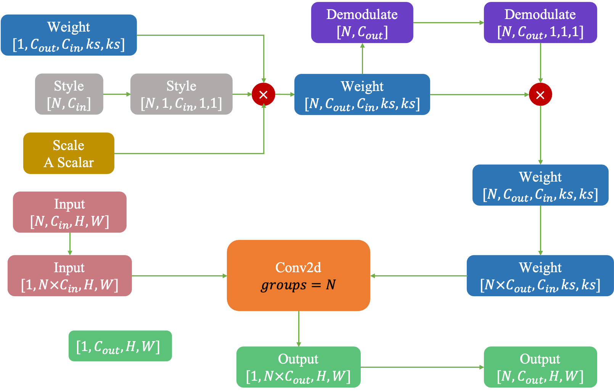
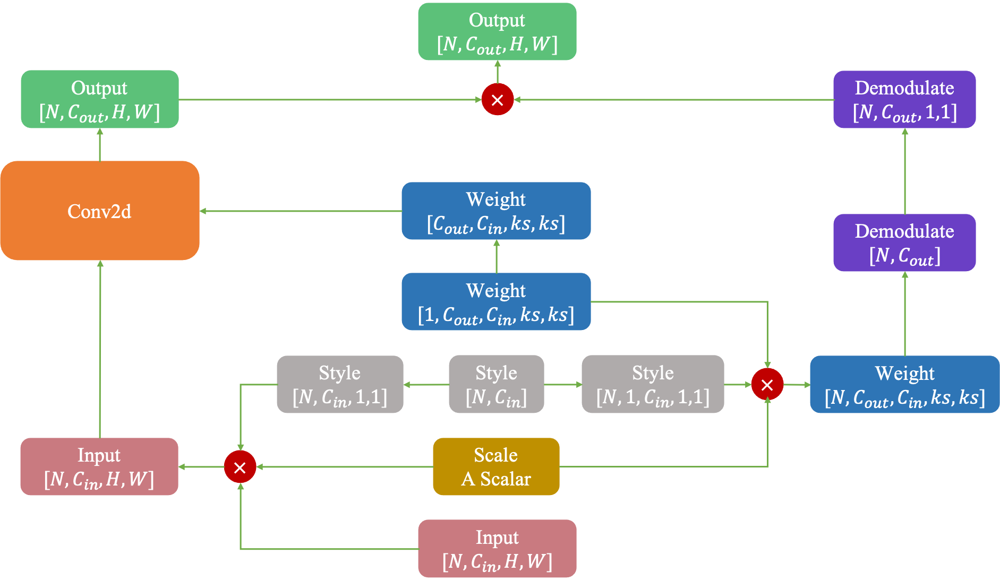

# Face Restoration TensorRT

A simple face restoration TensorRT deployment solution, supporting StyleGAN, RTX3090 5.5ms+.

 

## Requirements
- Ubuntu 20.04+
- CUDA 11.0+
- TensorRT 7.2+
- OpenCV 4.2.0+
- CMake 3.1.0+

## Bulid and Run
1. Clone this repository
```
git clone https://github.com/bychen7/Face-Restoration-TensorRT
cd Face-Restoration-TensorRT
```
2. Install the necessary dependencies
```
sudo apt-get update
sudo apt-get install cmake
sudo apt-get install libopencv-dev
```
3. Modify lines 16 and 17 of the `CMakeLists.txt` file to reflect the path to your TensorRT installation
```
16 include_directories(the_path_to/TensorRT/include)
17 link_directories(the_path_to/TensorRT/lib)
```
4. Build
```
mkdir build
cd build
cmake ..
make
```
5. Download the `model` ([BaiduPan](https://pan.baidu.com/s/19klcec1LlkWn_JspH82VPg) pwd: yxt7) and put them into `../models`, then generate the TensorRT engine 
```
./convert ../models/model.onnx -s ../models/model.engine
```
6. Run
```
// The output will be saved as a file named res.jpg
./demo ../models/model.engine -i ../images/test.png
```

## ModulatedConv2d

```
two inputs (data and weights) are allowed only in explicit-quantization mode.
```

If you encounter the above error when converting [GPEN](https://github.com/yangxy/GPEN) or [GFPGAN](https://github.com/TencentARC/GFPGAN) models(Methods based on the StyleGAN architecture) to TensorRT engines, you can try the following approach, which multiplies the `weights` and `styles` on the input in an equivalent way. The left image shows the original approach, while the right image shows the modified approach.

<span style="margin-right: 30px;"></span>


## MISC

If time permits, I will update the overall TensorRT deployment solution, including face detection, face alignment, face parsing, and more. This is just an engineering matter, as the core ModulatedConv2d deployment has already been published. Thank you for reading.

## Acknowledgments
- [GPEN](https://github.com/yangxy/GPEN)
- [GFPGAN](https://github.com/TencentARC/GFPGAN)
- [tensorrtx](https://github.com/wang-xinyu/tensorrtx)
